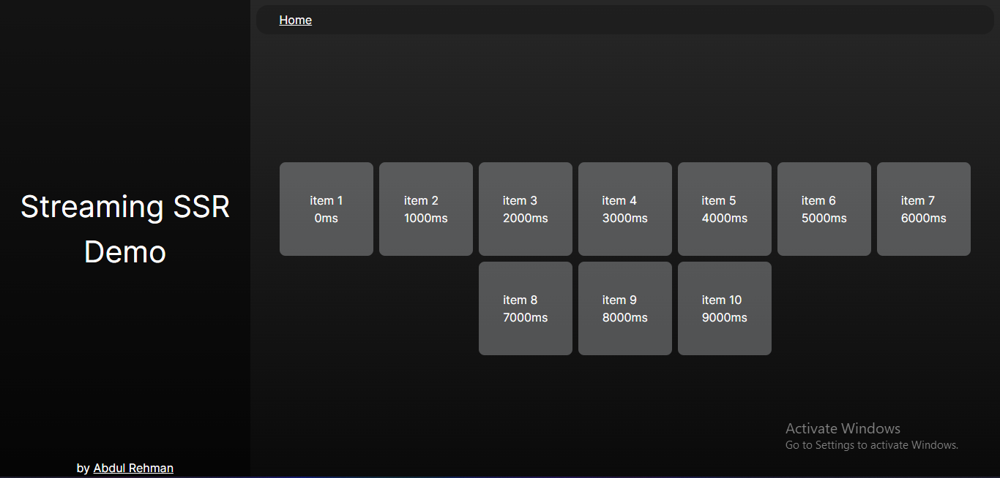
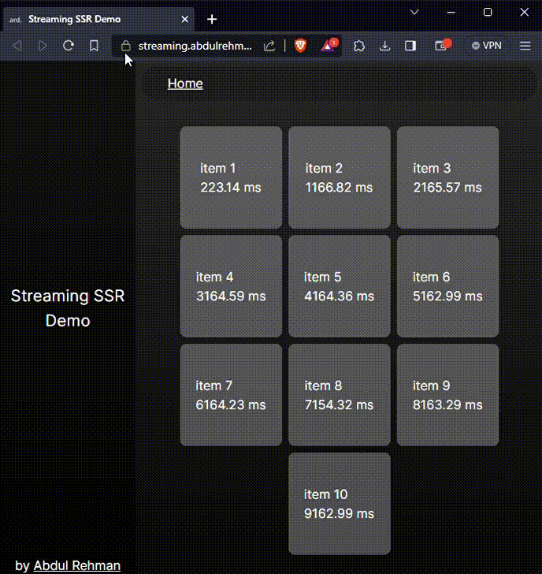

# Streaming SSR Demo
This is a Nextjs project made with app/ directory and React Server Components alongside Suspense stuff to achieve this streaming thing.  
Let's deploy it and test if it's worth the hype.
## Getting Started

First, run the development server:

```bash
npm run dev
```

Open [http://localhost:3000](http://localhost:3000) with your browser to see the result.

## Screenshots

